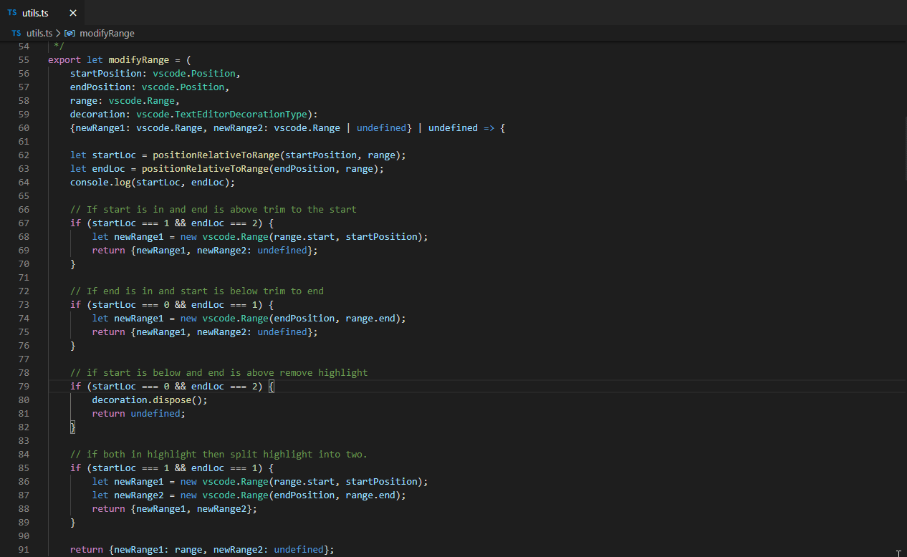
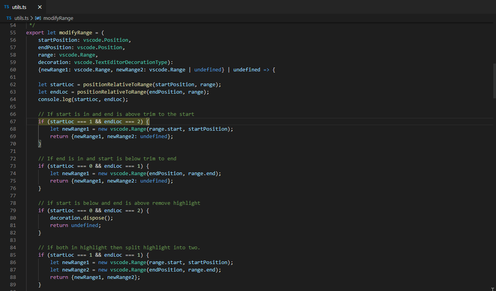
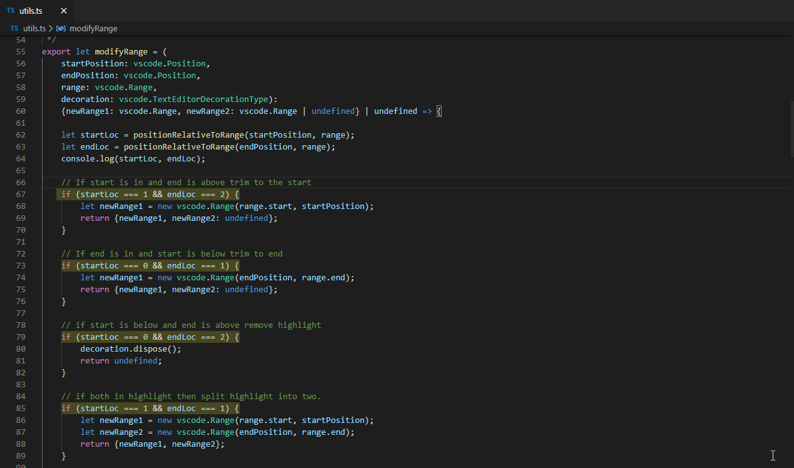

# VSCode Easy Highlight

Easily add or remove highlights from text.

## Features

### Highlight

### Remove Highlight

### Remove All Highlights

## Extension Settings

This extension contributes the following settings:

* `easy-highlight.highlightColor`: Change the color of the highlighter by passing a valid hexadecimal color.

## Release Notes

### 1.0.0

Initial release of Easy Highlight

### 1.1.0

Update Background

### 1.2.0

Highlights updated when new text is added or removed. 

## Known Issues:
- Selecting a single character and typing a single character reduces highlight range.
- Newlines added or removed within highlight range causes unexpected behavior.
- Multiline highlights end line will increase when typing.

